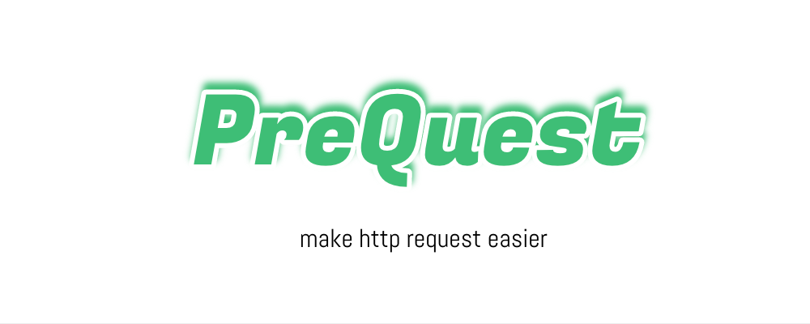

<div align=center>

</div>

# PreQuest

一套模块化，可插拔的 JS 运行时 HTTP 请求解决方案。

[](https://www.npmjs.com/package/@prequest/core)
[](https://bundlephobia.com/result?p=@prequest/core)
[](https://www.npmjs.com/package/@prequest/core)
[](https://github.com/prettier/prettier)
[](https://www.codacy.com/gh/xdoer/PreQuest/dashboard?utm_source=github.com&utm_medium=referral&utm_content=xdoer/PreQuest&utm_campaign=Badge_Grade)
[](https://github.com/xdoer/PreQuest/blob/main/LICENSE)

## 简介

PreQuest 是一套 JS 运行时的 HTTP 解决方案。

它包含了一些针对不同 JS 运行平台的封装的请求库，并为这些请求库提供了一致的中间件、拦截器、全局配置等功能的体验

还针对诸如 Token 的添加，失效处理，无感知更新、接口缓存、错误重试等常见业务场景，提供了解决方案。

当这些功能不满足你的需求、或者你想定制化时，也可以基于 @prequest/core 快速封装一个实现你需求的请求库。

## 支持平台

Web、小程序、ReactNative、快应用等

## 使用示例

下面以 @prequest/xhr 为例，介绍使用方法

```ts
import { PreQuest, create, Request, Response } from '@prequest/xhr'
import CacheMiddleware, { CacheInject } from '@prequest/cache'

// 全局配置
PreQuest.defaults.baseURL = 'http://locahost:8080'

// 全局中间件
PreQuest.use<Request, Response>((ctx, next) => {
  // 在这里，你可以全局修改请求参数
  console.log(ctx.request)

  await next()

  // 这里，你可以全局修改响应数据
  console.log(ctx.response)
})

/**
 * 创建实例
 * 注入类型, 可在调用时获得类型提示
 */
const prequest = create<CacheInject, {}>({
  headers: {
    token: 'xxx-11111111',
  },
})

// 实例中间件
const cacheMiddleware = CacheMiddleware({ ttl: 5000 })
prequest.use(cacheMiddleware)

// 请求调用
prequest('/user')
prequest('/user', { method: 'POST' })
prequest.get('/user', { params: { a: 1 } })
prequest.post('/user', { data: { a: 1 } })

// 响应类型注入
interface User {}
const user = await prequest<User>('/user', { params: { id: 1 } })
const user2 = await prequest.get<User>('/user', { params: { id: 1 } })
```

## 文档

[website: https://pre-quest.vercel.app](https://pre-quest.vercel.app/)

## 贡献

[Contributing Guide](/CONTRIBUTING.md)

## License

[MIT License](https://github.com/xdoer/PreQuest/blob/main/LICENSE)
